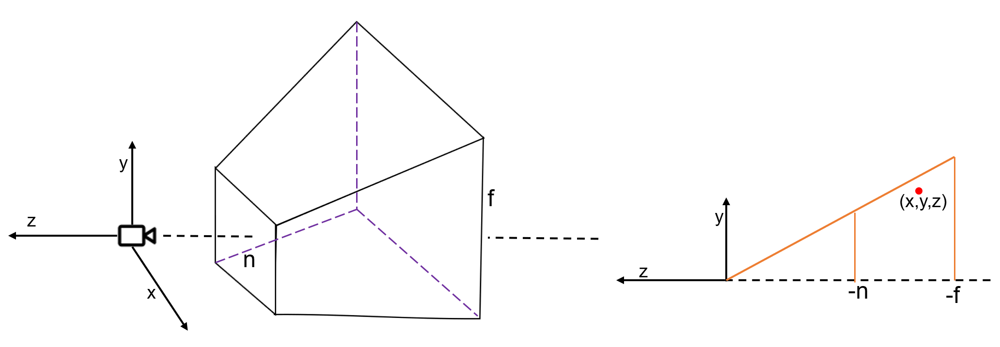

### Summary

本文介绍投影变换的计算，包括正交投影、透视投影。最后介绍一些实际应用中的技巧、以及如何运用到 Vulkan 坐标系。

- Settings：本文的向量采用列向量，与 glm 库的默认为行向量不同，只需将本文描述的公式整体转置即可转为行向量形式；clip 空间的深度值范围采用常见的 $[0,1]$ ；相机 forward 方向为 $-z$，up 方向为 $+y$ 。相机坐标系与正交投影的长方体视锥体 如下图所示：

  

其中 $l,r$ 为 $x$ 轴方向的左右表面到视锥体中心的距离，$b,t$ 为 $y$ 轴方向的上下表面到视锥体中心的距离，$n,f$ 为 $z$ 轴方向的前后表面到原点的距离(即近平面与远平面)。相机坐标系采用 Vulkan 的右手坐标系。

### Orthographic Projection

正交投影将 $(-l,r)\cross(-b,t)\cross(-n,-f)$ 的视锥体变换为 $(-1,1)\cross(-1,1)\cross(0,1)$。注意：通常情况下正交投影的视锥体定义为关于 $z$ 轴对称，即 $l=r,b=t$，在本文最后结果对应替换即可。正交投影的过程可分为两步：先将视锥体近平面的中心平移至相机坐标系的原点；再将大小进行缩放。

#### 1. 视锥体近平面的中心平移至原点

视锥体近平面中心坐标为 $\large \left(\frac{r-l}{2},\frac{t-b}{2},-n\right)$，因此构建平移矩阵
$$
M_{orthoT}=
\begin{pmatrix}
1 & 0 & 0 & \frac{l-r}{2} \\
0 & 1 & 0 & \frac{b-t}{2} \\
0 & 0 & 1 & n \\
0 & 0 & 0 & 1
\end{pmatrix}
$$

> 验证一下：对于左右表面的 $x$ 坐标，左表面 $x$ 坐标变换前 $-l$，有 $-l+\frac{l-r}{2}=\frac{-l-r}{2}$ ；右表面 $x$ 坐标变换前 $r$，有 $r+\frac{l-r}{2}=\frac{l+r}{2}$ 。变换后的 $x$ 坐标对称。

#### 2. frustum 进行缩放

经过平移后的视锥体为 $\large (\frac{-l-r}{2},\frac{l+r}{2})\cross(\frac{-b-t}{2},\frac{b+t}{2})\cross( 0,n-f)$，将平移后的视锥体缩放为   									   $(-1,1)\cross(-1,1)\cross(0,1)$，构建缩放矩阵
$$
M_{orthoS}=
\begin{pmatrix}
\frac{2}{l+r} & 0 & 0 & 0 \\
0 & \frac{2}{b+t} & 0 & 0 \\
0 & 0 & \frac{1}{n-f} & 0 \\
0 & 0 & 0 & 1
\end{pmatrix}
$$
至此就完成了构建正交投影矩阵
$$
M_{ortho} = M_{orthoS} \cdot M_{orthoT}
$$

### Perspective Projection

透视投影为了模拟现实中近大远小，采用截去头部的金字塔形状的 frustum，如下图所示

右图为左图的二维投影，透视投影的 frustum 是通过 fov 参数定义，所以是右图中过原点的情况，其中 $n,f$ 分别是近平面和远平面。

求解透视投影的投影矩阵可以分为两步：将透视投影的视锥体变形为正交投影的视锥体；再进行正交投影变换。

#### 1. frustum 视锥体挤压为长方体视锥体

##### 1.1 一般情况推导出变换矩阵的部分元素

将 frustum 远平面四个角进行挤压，将远平面变形为与近平面一样大小。假设变形前 frustum 内任一点为 $(x,y,z)$，变形为 $(x',y',z')$ 。变换前后的点有如下关系:

朝 $-x$ 方向看去的平面图，可以根据相似三角形有：
$$
\frac{y'}{y}=\frac{z'}{z}=\frac{-n}{z}
\\
 y'=\frac{-n}{z}\cdot y
$$
同理，从 $-y$ 方向看去的平面图，可得到：
$$
\frac{x'}{x}=\frac{-n}{z} \\
x'=\frac{-n}{z}\cdot x
$$
注意：对于 $z$ 变换前后是没有直观关系的，经过挤压变形 $z$ 坐标可能前移后移。

此时变换后的坐标为 $(\large \frac{-n}{z}\cdot x,\frac{-n}{z}\cdot y,z',1)$ ，对于齐次坐标，同时乘上一个坐标，不改变其表示的点，同时乘 $z$ 有：
$$
(-nx,-ny,zz',z)
$$
假设 frustum 到长方体的变换矩阵为 $M_{persp->ortho}$，目前已知以下变换成立：
$$
M_{persp->ortho}\cdot (x,y,z,1)^T =(-nx,-ny,zz',z)^T
$$
有变换前后对应关系可知 $M_{persp->ortho}$ 的第一行可以确定为 $(-n,0,0,0)$，第二行可以确定为 $(0,-n,0,0)$，第三行未知，第四行可以确定为 $(0,0,1,0)$。因此，此时
$$
M_{persp->ortho}=
\begin{pmatrix}
-n & 0 & 0 & 0 \\
0 & -n & 0 & 0 \\
? & ? & ? & ? \\
0 & 0 & 1 & 0
\end{pmatrix}
$$

###### 1.2 代入特殊点得到未知的 $z$ 坐标变换

虽然任意点的 $z$ 坐标变换前后的对应关系不能直观看出，但是对于在近平面和远平面上的点，其 $z$ 坐标变换前后不改变，因此有 $z'=z=-n$。代入近平面，将 $z'=z=-n$ 代入得到变换前的点有 $(x,y,-n,1)$，变换后的点有 $(-nx,-ny,n^2,-n)$。因此有 
$$
M_{persp->ortho}\cdot (x,y,-n,1)^T=(-nx,-ny,n^2,-n)^T
$$
由变换前后的 $z$ 坐标对应关系，有 $M_{persp->ortho}$ 的第三行前两个元素为 $0$，假设后两个元素为 $C,D$，可以列
$$
-Cn+D=n^2
$$
代入远平面，将 $z'=z=-f$ 代入得到变换前的点有 $(x,y,-f,1)$ ，变换后的点有 $(-nx,-ny,f^2,-f)$。因此有
$$
M_{persp->ortho}\cdot (x,y,-f,1)^T=(-nx,-ny,f^2,-f)^T
$$
可以列
$$
-Cf+D=f^2
$$
于是有 $C=-(n+f),D=-nf$，于是 frustum 变形为长方体的变换矩阵为：
$$
M_{persp->ortho}=
\begin{pmatrix}
-n & 0 & 0 & 0 \\
0 & -n & 0 & 0 \\
0 & 0 & -(n+f) & -nf \\
0 & 0 & 1 & 0
\end{pmatrix}
$$

#### 2. 完整的投影变换矩阵

$$
\begin{align} M_{persp} &= M_{ortho}\cdot M_{persp->ortho}=M_{orthoS} \cdot M_{orthoT}\cdot M_{persp->ortho} \\
&=\begin{pmatrix}
\frac{2}{l+r} & 0 & 0 & 0 \\
0 & \frac{2}{b+t} & 0 & 0 \\
0 & 0 & \frac{1}{n-f} & 0 \\
0 & 0 & 0 & 1
\end{pmatrix} \cdot
\begin{pmatrix}
1 & 0 & 0 & \frac{l-r}{2} \\
0 & 1 & 0 & \frac{b-t}{2} \\
0 & 0 & 1 & n \\
0 & 0 & 0 & 1
\end{pmatrix} \cdot
\begin{pmatrix}
-n & 0 & 0 & 0 \\
0 & -n & 0 & 0 \\
0 & 0 & -(n+f) & -nf \\
0 & 0 & 1 & 0
\end{pmatrix}
\end{align}
$$

#### 3. 透视投影非线性

透视投影具有非线性的性质，其非线性是由于最后的齐次坐标**除以 $w$ 分量 (divide z)** 引入的。这里我们只需关注 $w$ 分量的变换操作，因此只需关注透视投影矩阵变换的第四行。对于原坐标 $(x,y,z,1)$，经过透视变换后的 $w$ 分离由 $1$ 变为 $z$，即变换后的点为 $(x',y',z',z)$。

- 非线性带来的问题

  顶点面片光栅化为像素的插值操作，是以三角面片在像素点的重心坐标为参数进行插值的，这个过程是线性过程。但由于投影变换引入了非线性，在三维空间线性变化的顶点属性，经过投影变换，在屏幕空间并不是线性变化，因此不能直接使用重心坐标进行顶点属性的插值。如下图所示：

  

  三维空间的线 $AB$，投影到屏幕空间 $ab$。$ab$ 的中点对应的却不是 $AB$ 的中点。

为了解决透视投影带来的非线性问题，插值引入了 [perspective-correct interpolation](https://www.comp.nus.edu.sg/~lowkl/publications/lowk_persp_interp_techrep.pdf)，目前 vertex shader 到 pixel shader 的变量，默认都为 perspective-correct interpolation。

### Practical Tricks 

#### 1. $w$ 分量归一化与 divide z

在 shader 中，对坐标进行透视投影后进行齐次坐标 $w$ 分量归一化时，除以 $w$ 和除以 $z$ 分量都一样，因为透视投影得到的 $w$ 分量与变换前的 $z$ 坐标相等。

#### 2.屏幕空间的像素坐标到相机空间的逆变换

在某些算法中，经常需要从屏幕像素坐标恢复到相机空间的坐标。

- 在 pixel shader 中进行逆投影变换（低效）

  使用透视投影的逆矩阵可以直接做到，如

$$
inverse(M_{persp})\cdot (p.x,p.y,p.z)
$$

- vertex shader 中进行 $(x,y)$ 逆变换，pixel shader 中进行 depth 逆变换（高效）

  直接在 pixel shader 中进行逆投影变换，较为低效，可以在 vertex shader 中计算。对于具有顶点输入的 pass，vertex shader 中只进行 view transform，不进行透视变换，此时变换后的顶点还处于三维线性空间中，即变换后的 $w$ 分量还是 $1$，因此到 pixel shader 的插值还是线性插值。

  多数情况是 postprocess 的算法，vertex shader 只是 quad 绘制，没有顶点信息。可以在 vertex shader 中 quad 绘制得到的 texturecoord 坐标进行逆透视投影，转到 view space 中，此时只需要传逆变换后的 $( x,y)$ 坐标到 pixel shader。在 pixel shader 中，只将 depth 信息变换回 view space。只是 depth 的逆变换，不需要对整个透视投影进行求逆。变换前点为 $(x,y,z,1)$，有投影变换：

$$
\begin{align}
M_{persp}\cdot (x,y,z,1)^T &=M_{orthoS} \cdot M_{orthoT}\cdot M_{persp->ortho}\cdot (x,y,z,1)^T \\
&=M_{orthoS} \cdot M_{orthoT}\cdot\Big(-nx,-ny,-(n+f)z-nf,z\Big)^T \\
&= M_{orthoS} \cdot \Big(?,?,-(n+f)z-nf+nz,z\Big)^T \\
&= \Big(?,?,\frac{-(n+f)z-nf+nz}{n-f},z\Big)^T 
\end{align}
$$

​			即变换后的像素深度
$$
p.z=\frac{-(n+f)z-nf+nz}{n-f}\cdot \frac{1}{z} \\
z=\frac{-nf}{(n-f)p.z+f}
$$
​			pixel shader 中只需要进行上式对 $z$ 的逆变换，即 **Linearize Depth**。

